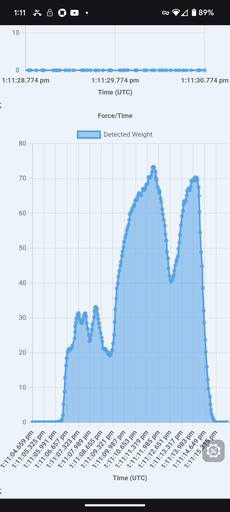

# Digital Hangboard
#### Project Album and YouTube demo
* https://photos.app.goo.gl/wRxz9BxxeJGzHZhK6
* https://youtube.com/shorts/t4RoINdm0Y4

---

I thought it would be fun to create a Hangboard capable of measuring and logging how much weight I could apply through my fingertips. A hangboard is a tool that is commonly used by rock climbers, but usually they don't have integrated electronics.

Over the course of this project I was able to enjoy playing with (to varying degrees) 3d modeling, 3d printing, cnc routing, react + next.js, bluetooth, electrical engineering, firmware development.

I used an esp32 microcontroller to read the sensors and report the data to a tiny screen, as well as a web app over bluetooth.

To detect the weight I used 4 load cells and 4 high resolution analog to digital converters.
* https://www.adafruit.com/product/4538
* https://www.robotshop.com//products/micro-load-cell-50-kg

When I started this project I did not have access to a CNC router, but I did have a 3d printer. I designed the model so that it could be manufactured on either, which made it easy to iterate and validate my design with the tools at my disposal.

To make this work I designed the hangboard as a series of layers that was held together by Stainless Steel threaded rods, lock nuts, and washers.

* M5 x 150mm Fully Threaded Rod 304 Stainless Steel - 6 pieces
* M5 x 0.8mm Nylon Insert Hex Lock Nuts 304 Stainless Steel
* M5 x 15mm x 1.2mm Large Flat Washers, 304 Stainless Steel

---

The Mounting system is pretty cool. I though a lot about different ways to mount it, but I had a few constraints I wanted to work within.
* Limit manual work steps
* No new materials, just wood ideally
* Not bulky, ideally hidden

There are two rectangular slots in the front and back of the hangboard. A regtangular peg that fits in the back slot is attached to a wall. Once the peg is in place, the handboard slot should fit over it. This keeps it from moving Left, Right, Up, and Down.

After the hangboard is in place, another identical peg is placed in the slot in the front, and screws are driven all the way into the same backing material as the first peg. This prevents the hangboard from sliding forward off the first peg, and gives it additional support.

This means the Hangboard is held to the backing material by 12 heavy duty screws.

